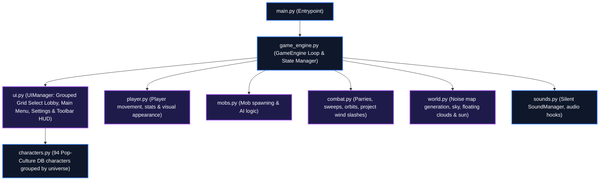

# ⚔️ Varius

[](https://www.python.org/)
[](https://www.pygame.org/)
[](https://github.com/catppuccin/catppuccin)
[](https://opensource.org/licenses/MIT)

A pixelated 2D action exploration game combining the swarm mechanics of **Vampire Survivors**, the block-mining world design of **Terraria**, the stance-based combat of **Ghost of Tsushima**, and a roster of 94 pop-culture selectable heroes.

---

## 📖 Table of Contents
- [Key Features](#-key-features)
- [System Architecture](#-system-architecture)
- [Quick Setup & Installation](#-quick-setup--installation)
- [How to Play](#-how-to-play)
  - [Controls Guide](#controls-guide)
  - [Combat Stances](#combat-stances)
- [Save & Load Management](#-save--load-management)
- [License](#-license)

---

## ✨ Key Features

- 👥 **94 Selectable Heroes**: Play as Dua Lipa, Saitama, Charli XCX, Moo Deng, Chappell Roan, Olivia Rodrigo, Steve Harrington, Goku, Zoro, and many more. Each features customized pixel color themes, stats (Max Health, Speed, Armor, Magnet), and custom starting weapons.
- 🎨 **4x Detailed Sprite Rendering**: Custom procedural rendering of high-fidelity character sprites with smooth shading, dynamic visual stances, and outlines.
- 🗂️ **Grouped Character Grid**: Select from your survivors in a clean categorized grid layout organized by show and universe origins.
- 📺 **Minecraft-Style 3D Main Screen**: Start new games, adjust settings, and load save states directly from a dedicated title screen featuring an extruded blocky logo.
- ⚔️ **Stance Combat System**: Swap between **Stone** (heavy posture break), **Water** (spinning auto-shield blades), and **Wind** (seeking projectile wind slashes) stances.
- 🛡️ **Parrying & Blocking**: Hold Shift to block damage or tap it at the perfect moment to trigger a **Perfect Parry** counter-attack that sweeps surrounding mobs.
- ☁️ **Parallax Sky & Caves**: Floating clouds and a glowing sun above-ground, transitioning into dark cave layers generated procedurally.
- 📦 **Colony Simulator**: Rescue trapped NPC captives inside cages and assign them jobs (Miner, Blacksmith, Scholar) at base camp to passively generate materials.
- 💾 **3-Slot Save State**: Instantly save or load your progress through the settings menu.

---

## ⚙️ System Architecture

The following block diagram outlines the internal layout and entity interaction pipeline of the game:



---

## 🚀 Quick Setup & Installation

This game requires **Python 3.12+** and **Pygame 2.6+**.

### 1️⃣ Clone or Download
Ensure all files are placed in a single directory:
```bash
git clone <YOUR_REPO_URL>
cd <REPO_DIRECTORY>
```

### 2️⃣ Install Pygame
Install the required game rendering library:
```bash
pip install -r requirements.txt
```

### 3️⃣ Launch the Game
Run the entry script:
```bash
python main.py
```

---

## 🛠️ How to Play

### Controls Guide
* **Movement**: `A` / `D` (or Left/Right Arrows)
* **Jump**: **`Space`** (or `W` / Up Arrow)
* **Block / Parry**: **`Left Shift`** or **`Right Shift`**
* **Toolbar Select**: Keys `1`–`5`
* **Use Selected Item / Attack**: **`F` Key**
  * Target tile is determined by movement keys (`W/A/S/D` or arrows) held at the moment of pressing `F`.
  * Select Slot 1 (Pickaxe) $\rightarrow$ Hold movement key towards target $\rightarrow$ Press `F` to mine.
  * Select Slot 2 (Katana/Unique weapon) $\rightarrow$ Press `F` to swing.
  * Select Slot 3 (Block) $\rightarrow$ Hold movement key towards target $\rightarrow$ Press `F` to build a dirt tile (requires iron).
  * Slots 4 & 5 (Stance triggers) $\rightarrow$ Press `F` to change combat stances.
* **Settings Panel**: Press **`O`** to open zoom adjustments and save slots.
* **Base Camp Management**: Press **`T`** to manage rescued survivors.

### Combat Stances
1. **Stone Stance** (Slot 2): Heavy physical strikes dealing massive posture damage and knockbacks.
2. **Water Stance** (Slot 4): Orbital shield blades spin around you, slicing passing monsters.
3. **Wind Stance** (Slot 5): Shoots wind slash waves targeting the closest enemy unit.

---

## 💾 Save & Load Management
Open settings with **`O`** and click **SAVE** or **LOAD** on any of the 3 slots. Game progress is serialized to local JSON files (`save_slot_1.json` to `save_slot_3.json`).

---

## 📄 License
This repository is licensed under the [MIT License](LICENSE).
